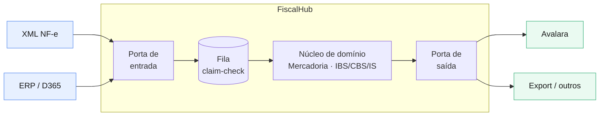

<h1 align="center">FiscalHub</h1>

<p align="center">
  Middleware de integração fiscal plugável, em .NET, já preparado para a Reforma Tributária (IBS/CBS/IS).
</p>

<p align="center">
  
  
  
  
</p>

---

Recebe notas fiscais já emitidas — de um ERP ou de arquivos XML — e as despacha para uma
plataforma de compliance tributário (Avalara e afins), traduzindo cada documento para um
modelo de domínio interno no caminho.

## O problema

A NT 2025.002 da NF-e introduziu IBS, CBS e Imposto Seletivo por item, com obrigatoriedade a
partir de 2026. Quem integra ERPs a plataformas de compliance precisa carregar esses campos
novos sem perder nada no caminho — e ainda lidar com origens e destinos que mudam de cliente
para cliente. O FiscalHub é a camada do meio: uma entrada agnóstica de origem, uma saída
agnóstica de destino, e um núcleo estável entre as duas.

## Arquitetura

Ports & adapters (hexagonal). No centro, um modelo de domínio por tipo de documento — a
representação interna que não muda quando se troca o ERP de origem ou a plataforma de destino.
Nas bordas, adapters plugáveis traduzem de e para os formatos externos. Entre origem e
destino, uma esteira assíncrona (fila + claim-check) move os documentos com idempotência,
retry e dead queue.



O raciocínio por trás de cada decisão está em [`docs/adr`](docs/adr).

## Escopo

Recebe, traduz e despacha. **Não** emite notas, **não** assina com certificado, **não**
transmite à SEFAZ e **não** calcula imposto — isso é responsabilidade de quem emite e de quem
apura. O hub assume que a nota já foi autorizada (cStat 100) e cuida do envio confiável
dela até o destino.

## Estado atual

Implementado e testado: o domínio (NF-e 55 com IBS/CBS/IS), as portas, a esteira (idempotência,
validação, despacho), o parser de XML, o mapper e o dispatcher da Avalara (com cache de token) e o
store em SQL. O fluxo **roda de ponta a ponta localmente** (XML no Blob → esteira → mock → SQL) —
veja [docs/RUNNING.md](docs/RUNNING.md).

Em sequência: o gatilho de Service Bus (fila + retry/DLQ), o painel de acompanhamento, e novos
tipos de documento (CT-e, NFS-e). O histórico de commits acompanha a evolução.

## Limites conscientes

Conectores reais de SAP/D365, integração real com a Avalara, emissão e transmissão à SEFAZ,
certificado digital e multi-tenant real estão fora do escopo desta implementação de
referência — ficam anotados como evolução. A meta é demonstrar a arquitetura funcionando de
ponta a ponta num caminho vertical real, não cobrir toda a superfície fiscal.

## Stack

| Camada | Tecnologia |
|--------|-----------|
| Backend | .NET 10 (LTS), C# |
| Painel | React |
| Mensageria | Azure Service Bus |
| Armazenamento | Blob (payload) + Azure SQL serverless (metadados) |
| Publicação | Static Web Apps · Functions / Container Apps |
| Dev local | Docker + Azurite (sem custo) |

## Rodando localmente

O fluxo roda de ponta a ponta na sua máquina, sem Azure (Azurite + SQL em containers, mock de
compliance local). Passo a passo completo em **[docs/RUNNING.md](docs/RUNNING.md)**.

Resumo:

```powershell
docker compose up -d                                              # Blob (Azurite) + SQL
dotnet run --project tools/MockComplianceApi --urls http://localhost:5100
dotnet run --project src/FiscalHub.Host      --urls http://localhost:5200
```

Depois, `POST http://localhost:5200/ingest` dispara a esteira: lê o XML do Blob, valida, despacha
pro mock e grava o status no SQL.

## Reforma Tributária

O modelo de mercadoria carrega o grupo de IBS, CBS e Imposto Seletivo (com CST e cClassTrib)
por item, conforme a NT 2025.002. O objetivo é enviar esses campos sem perda da origem
até o destino — a apuração em si fica com a plataforma de compliance.
